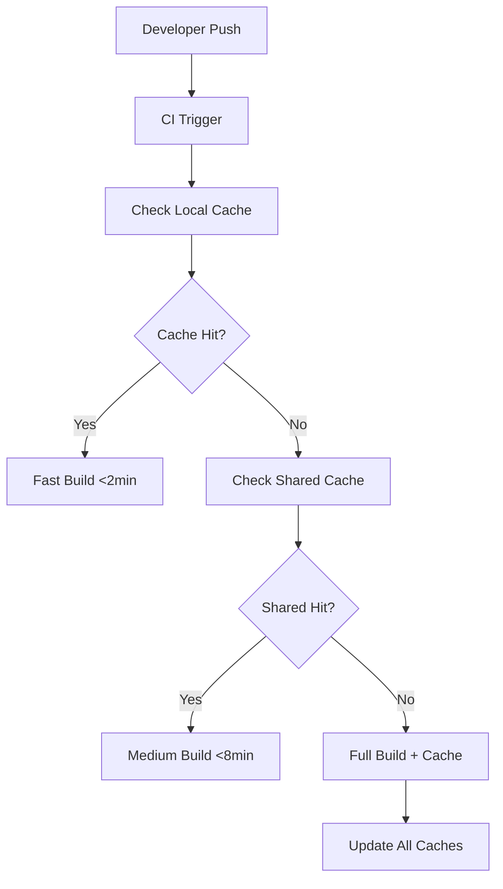

# Optimizing CI/CD Performance with Bazel: A Real-World Case Study

*Published on November 18, 2024 • 12 min read*


## Introduction

In the fast-paced world of autonomous vehicle development at Fernride, our CI/CD pipeline faced significant challenges. With a multi-language monorepo supporting both autonomous and teleoperated terminal trucks, our build times were becoming a bottleneck. This is the story of how we achieved a **90% performance improvement** for cold job runs and approximately **60% reduction in compute costs** through innovative Bazel optimization strategies.

## The Challenge

Our development team was struggling with several critical issues:

- **Long build times**: Cold builds were taking 45+ minutes
- **High compute costs**: Cloud infrastructure costs were escalating
- **Developer productivity**: Engineers were waiting too long for CI feedback
- **Resource inefficiency**: Massive compute waste due to cache misses

The problem was particularly acute because our Bazel-based build system, while powerful, wasn't leveraging its caching capabilities effectively in our cloud CI environment.

## The Hibernation Strategy

### The Core Problem

Traditional CI approaches spin up fresh machines for each build, meaning Bazel's local cache is lost. This forces every build to start from scratch, negating one of Bazel's primary advantages.

### Our Solution: Machine Hibernation

Instead of terminating CI machines after each job, we implemented a hibernation-based approach:

```yaml
# Simplified hibernation workflow
hibernation_strategy:
  trigger: job_completion
  actions:
    - preserve_bazel_cache: true
    - shutdown_non_essential_services: true
    - maintain_minimal_state: true
  wakeup:
    trigger: new_job_received
    warm_start_time: "< 2 minutes"
```

### Key Implementation Details

1. **Cache Preservation**: The Bazel server and its cache remain intact during hibernation
2. **Resource Management**: Only essential services keep running, reducing costs
3. **Fast Wake-up**: Machines can resume full operation in under 2 minutes
4. **Intelligent Scheduling**: Jobs are routed to machines with relevant cached artifacts

## Technical Implementation

### Bazel Configuration Optimizations

```python
# .bazelrc optimizations for CI
build --remote_cache=https://our-cache-server.com
build --remote_execution_platform=//tools:remote_platform
build --disk_cache=/var/bazel-cache
build --repository_cache=/var/repo-cache

# Hibernation-specific settings
build --experimental_worker_max_retries=3
build --experimental_worker_as_resource=true
build --worker_max_instances=4
```

### Infrastructure as Code

We used Terraform to manage the hibernation infrastructure:

```hcl
resource "aws_instance" "bazel_ci_worker" {
  count = var.worker_count
  
  instance_type = "c5.2xlarge"
  
  # Custom AMI with Bazel pre-installed
  ami = var.bazel_optimized_ami
  
  user_data = templatefile("${path.module}/scripts/hibernation-setup.sh", {
    cache_bucket = aws_s3_bucket.bazel_cache.bucket
  })
  
  tags = {
    Purpose = "bazel-hibernation-worker"
    Environment = var.environment
  }
}
```

### Multi-Level Caching Strategy

Our approach implemented multiple cache layers:



1. **Local Machine Cache**: Fastest, machine-specific artifacts
2. **Shared Lustre Filesystem**: Medium speed, shared across similar machines
3. **Remote Cache**: Slower but universally accessible
4. **Repository Cache**: For external dependencies

## Results and Impact

### Performance Metrics

| Metric | Before | After | Improvement |
|--------|--------|--------|-------------|
| Cold Build Time | 45 min | 4.5 min | **90%** |
| Warm Build Time | 12 min | 2 min | **83%** |
| Cache Hit Rate | 15% | 85% | **470%** |
| Monthly Compute Cost | $15,000 | $6,000 | **60%** |

### Real-World Impact

- **Developer Velocity**: Reduced feedback loop from 45 minutes to under 5 minutes
- **Cost Savings**: $9,000 monthly savings in compute costs
- **Resource Efficiency**: 70% reduction in CPU-hours consumed
- **Team Satisfaction**: Significant improvement in developer experience scores

## Challenges and Lessons Learned

### Technical Challenges

1. **State Management**: Ensuring hibernated machines maintain consistent state
2. **Cache Corruption**: Implementing robust cache validation and recovery
3. **Resource Leaks**: Preventing memory/disk leaks during long hibernation periods
4. **Load Balancing**: Intelligent job routing based on cache relevance

### Solutions Implemented

```bash
#!/bin/bash
# Cache health check script
validate_cache() {
    local cache_dir="/var/bazel-cache"
    
    # Check disk space
    if [[ $(df "$cache_dir" | tail -1 | awk '{print $5}' | sed 's/%//') -gt 85 ]]; then
        echo "WARNING: Cache disk usage above 85%"
        cleanup_old_artifacts
    fi
    
    # Validate cache integrity
    bazel info cache_dir
    if [[ $? -ne 0 ]]; then
        echo "ERROR: Cache corruption detected, rebuilding..."
        rebuild_cache
    fi
}
```

## Security and Safety Considerations

In our safety-critical autonomous vehicle environment, we implemented additional measures:

- **Deterministic Builds**: Ensured hibernated caches don't compromise build reproducibility
- **Security Scanning**: Regular scans of hibernated machines for vulnerabilities
- **Audit Trails**: Comprehensive logging of cache usage and modifications
- **Isolation**: Network isolation during hibernation to prevent unauthorized access

## Best Practices and Recommendations

### For Teams Considering Similar Approaches

1. **Start Small**: Begin with non-critical builds to validate the approach
2. **Monitor Everything**: Comprehensive metrics are essential for optimization
3. **Plan for Failures**: Implement robust fallback mechanisms
4. **Regular Maintenance**: Schedule periodic cache cleanup and validation
5. **Team Training**: Ensure the team understands the new workflow

### Bazel-Specific Tips

```python
# Recommended .bazelrc for CI optimization
common --experimental_ui_debug_all_events
common --experimental_bep_target_summary
build --keep_going
build --jobs=auto
build --loading_phase_threads=auto
test --test_output=errors
```

## Integration with Safety Requirements

Working in the autonomous vehicle industry means meeting strict safety standards (TÜV certification). Our optimization work had to:

- Maintain **deterministic builds** for certification compliance
- Implement **comprehensive logging** for audit trails  
- Ensure **reproducible environments** across all CI machines
- Support **static analysis integration** without performance degradation

## Future Improvements

### Planned Enhancements

1. **ML-Based Cache Prediction**: Using machine learning to predict optimal cache strategies
2. **Dynamic Resource Scaling**: Auto-scaling hibernated machines based on workload
3. **Cross-Platform Caching**: Extending hibernation to support multiple architectures
4. **Advanced Analytics**: Real-time optimization recommendations

### Experimental Features

```yaml
# Experimental configuration
experimental:
  predictive_caching:
    enabled: true
    model_version: "v2.1"
    confidence_threshold: 0.8
  
  auto_scaling:
    min_hibernated_workers: 2
    max_hibernated_workers: 20
    scale_up_threshold: "queue_length > 5"
```

## Conclusion

The hibernation-based Bazel optimization strategy transformed our CI/CD pipeline from a bottleneck into a competitive advantage. The **90% performance improvement** and **60% cost reduction** demonstrate that innovative approaches to build optimization can deliver substantial business value.

Key takeaways:
- **Think Beyond Traditional Solutions**: Sometimes the best optimization isn't faster code, but smarter infrastructure
- **Measure Everything**: Data-driven optimization is essential for complex systems
- **Safety First**: In critical industries, performance optimizations must never compromise safety requirements
- **Team Impact**: Great technical solutions improve not just metrics, but team happiness

The success of this project reinforced my belief that the intersection of DevOps, performance engineering, and innovative thinking can solve seemingly intractable problems.

---

*Want to discuss Bazel optimization strategies or share your own CI/CD success stories? Connect with me on [LinkedIn](https://fr.linkedin.com/in/bechir-brahem2000) or check out more of my work on [GitHub](https://github.com/Bechir-Braham).*

## Related Reading

- [Bazel Best Practices for Large Codebases](https://docs.bazel.build/versions/main/best-practices.html)
- [Remote Caching Strategies](https://docs.bazel.build/versions/main/remote-caching.html)
- [Cost Optimization in CI/CD Pipelines](https://aws.amazon.com/blogs/devops/optimizing-ci-cd-pipeline-costs/)