# Visualizing System Architecture with Mermaid Diagrams

System architecture diagrams are essential for understanding complex software systems. In this post, I'll demonstrate how Mermaid diagrams can be used to visualize different architectural patterns.

## High-Level System Architecture

Here's a typical microservices architecture:

```mermaid
graph TB
    User[👤 User] --> LB[Load Balancer]
    LB --> API1[API Gateway 1]
    LB --> API2[API Gateway 2]
    
    API1 --> Auth[Authentication Service]
    API1 --> User_Service[User Service]
    API1 --> Order_Service[Order Service]
    
    API2 --> Auth
    API2 --> Payment_Service[Payment Service]
    API2 --> Notification_Service[Notification Service]
    
    User_Service --> UserDB[(User Database)]
    Order_Service --> OrderDB[(Order Database)]
    Payment_Service --> PaymentDB[(Payment Database)]
    
    Order_Service --> Queue[Message Queue]
    Queue --> Notification_Service
    Queue --> Payment_Service
```



## Database Entity Relationships

Here's how our data models relate to each other:


## CI/CD Pipeline Flow

Our deployment pipeline follows this sequence:


## State Machine for Order Processing

Orders go through various states in our system:


## Git Branch Strategy

Our development workflow uses GitFlow:

```mermaid
gitgraph
    commit id: "Initial"
    branch develop
    checkout develop
    commit id: "Feature A start"
    
    branch feature/auth
    checkout feature/auth
    commit id: "Add login"
    commit id: "Add logout"
    
    checkout develop
    merge feature/auth
    commit id: "Auth integration"
    
    branch release/v1.0
    checkout release/v1.0
    commit id: "Prep v1.0"
    commit id: "Bug fixes"
    
    checkout main
    merge release/v1.0
    commit id: "v1.0 Release"
    
    checkout develop
    merge release/v1.0
    commit id: "Back-merge fixes"
```

These diagrams help visualize complex systems and make architectural decisions more accessible to both technical and non-technical stakeholders.

## Benefits of Visual Documentation

Using Mermaid for system documentation provides several advantages:

- **Version Control**: Diagrams are stored as text, making them easy to track in Git
- **Consistency**: Standardized syntax ensures uniform diagram styling
- **Maintainability**: Updates are simple text edits, not complex graphic manipulations
- **Integration**: Renders directly in markdown, perfect for README files and wikis

Visual documentation bridges the gap between complex technical systems and clear communication, making it an essential tool in any developer's toolkit.